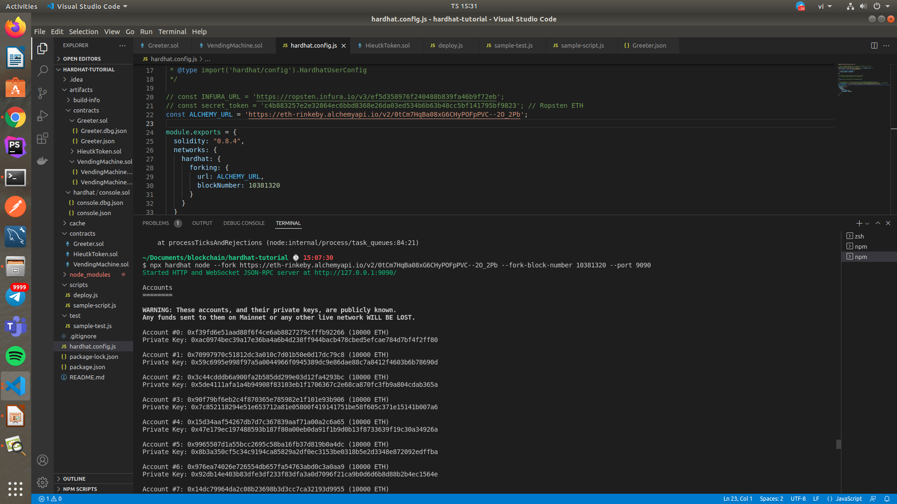
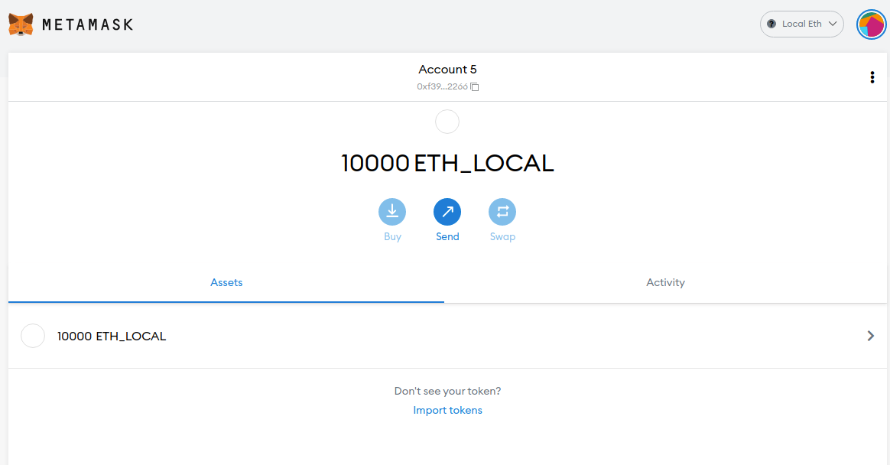
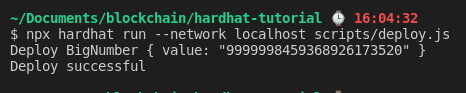
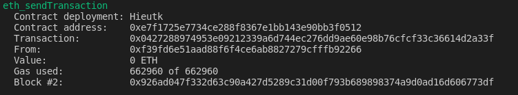
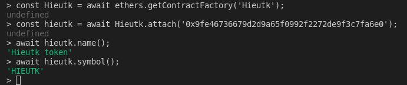

#Mainnet forking

##Forking from mainnet
`npx hardhat node --fork https://eth-mainnet.alchemyapi.io/v2/<key>`
>networks: {
  hardhat: {
    forking: {
      url: "https://eth-mainnet.alchemyapi.io/v2/<key>",
    }
  }
}

##Pinning a block
Hardhat Network caches it on disk to speed up future access

Use https://www.alchemy.com/

>networks: {
  hardhat: {
    forking: {
      url: "https://eth-mainnet.alchemyapi.io/v2/<key>",
      blockNumber: 11095000
    }
  }
}

>example: npx hardhat node --fork https://eth-rinkeby.alchemyapi.io/v2/0tCm7HqBa08xG6CHyPOFpPVC--2O_2Pb --fork-block-number 10381320 --port 9090

- Folk Rinkeby Network

- deploy smartcontract

- Using console

