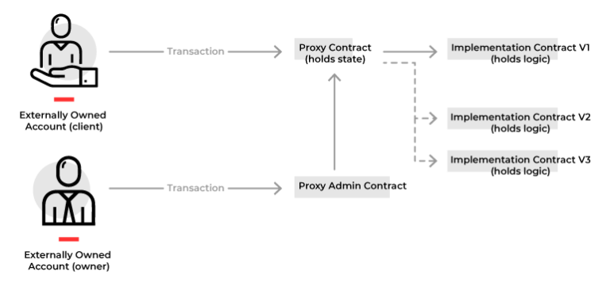
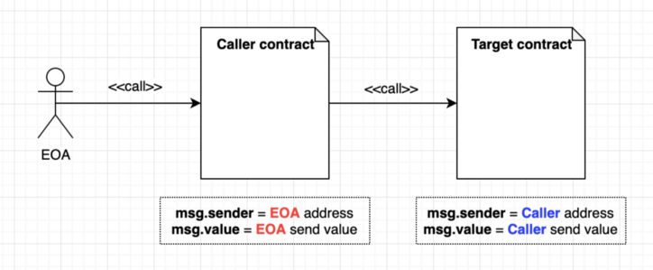
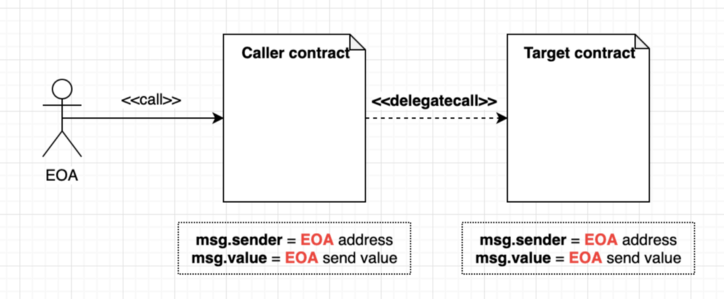
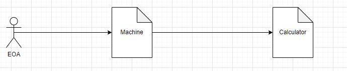
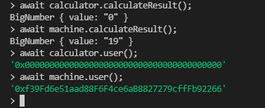
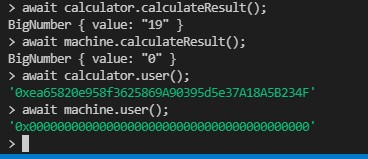
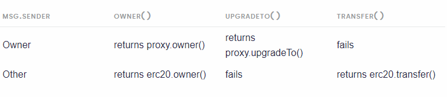

##Proxy

**1. Proxy patterns**


**2. Delegatecall and Call**

**2.1 Call**


**2.2 Call**


**2.3 experiment**




Contract `machine.sol`

```
// contracts/May.sol
//SPDX-License-Identifier: Unlicense
pragma solidity ^0.8.4;

import "./storage.sol";


contract Machine {
    uint256 public calculateResult;

    address public user;

    event AddedValuesByDelegateCall(uint256 a, uint256 b, bool success);
    event AddedValuesByCall(uint256 a, uint256 b, bool success);

    constructor() {
        calculateResult = 0;
    }

    function addValuesWithDelegateCall(
        address calculator,
        uint256 a,
        uint256 b
    ) public returns (uint256) {
        (bool success, bytes memory result) = calculator.delegatecall(
            abi.encodeWithSignature("add(uint256,uint256)", a, b)
        );
        emit AddedValuesByDelegateCall(a, b, success);

        return abi.decode(result, (uint256));
    }

    function addValuesWithCall(
        address calculator,
        uint256 a,
        uint256 b
    ) public returns (uint256) {
        (bool success, bytes memory result) = calculator.call(
            abi.encodeWithSignature("add(uint256,uint256)", a, b)
        );
        emit AddedValuesByCall(a, b, success);
      
        return abi.decode(result, (uint256));
    }
}
```


Contract `calculator.sol`
```
// contracts/May.sol
//SPDX-License-Identifier: Unlicense
pragma solidity ^0.8.4;

contract Calculator {
    uint256 public calculateResult;
    
    address public user;
    
    event Add(uint256 a, uint256 b);
    
    function add(uint256 a, uint256 b) public returns (uint256) {
        calculateResult = a + b;
        assert(calculateResult >= a);
        
        emit Add(a, b);
        user = msg.sender;
        
        return calculateResult;
    }
}
```

- Console
```
> const Calculator = await ethers.getContractFactory('Calculator');
undefined
> const calculator = await Calculator.attach('0x7De0095B308131DaadcEbB45CeC270697ad1d1d1');
undefined
> const Machine = await ethers.getContractFactory('Machine');
undefined
> const machine = await Machine.attach('0x19522513C8E0D3b432AE8FA3fd800bcD38C7E2d9');
undefined
```

- DelegateCall
```
await machine.addValuesWithDelegateCall('0x7De0095B308131DaadcEbB45CeC270697ad1d1d1', 9,10);
```

 > context: Machine
 
- Call
```
await machine.addValuesWithCall('0x7De0095B308131DaadcEbB45CeC270697ad1d1d1', 9,10);
```

>context: Calculator

**3. Transparent**


```
  /**
  * @dev Throws if called by any account other than the owner.
  */
  modifier onlyProxyOwner() {
    require(msg.sender == proxyOwner());
    _;
  }
  ```
**4. Malicious backdoors in Ethereum Proxies**
If both the proxy and proxied contracts had a function `owner()` ???
```
  /**
  * @dev Throws if called by any account other than the owner.
  */
  modifier onlyProxyOwner() {
    if (msg.sender == proxyOwner()) {
      _;
    } else {
      _delegate();
    }
  }
  ```
**5. Gas of DELEGATECALL**
Gas Calculation:

`base_gas = access_cost + mem_expansion_cost`
Calculate the `gas_sent_with_call `below. ( https://github.com/wolflo/evm-opcodes/blob/main/gas.md#aa-f-gas-to-send-with-call-operations)

And the final cost of the operation:

`gas_cost = base_gas + gas_sent_with_call`

**6. Refs**
- https://medium.com/coinmonks/ethernaut-lvl-6-walkthrough-how-to-abuse-the-delicate-delegatecall-466b26c429e4
- https://docs.soliditylang.org/en/v0.8.3/introduction-to-smart-contracts.html?highlight=DELEGATECALL#delegatecall-callcode-and-libraries
- https://blog.openzeppelin.com/the-state-of-smart-contract-upgrades/
- [Malicious backdoors in Ethereum Proxies] (https://medium.com/nomic-foundation-blog/)malicious-backdoors-in-ethereum-proxies-62629adf3357)
- https://github.com/wolflo/evm-opcodes/blob/main/gas.md
- https://docs.openzeppelin.com/upgrades-plugins/1.x/
- [Transparent] (https://github.com/zeppelinos/zos-lib/pull/36)
- https://solidity-by-example.org/delegatecall/