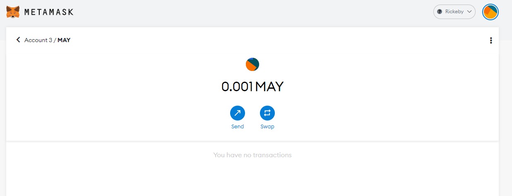
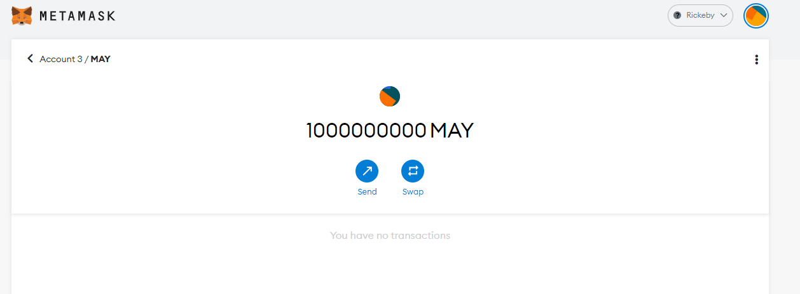
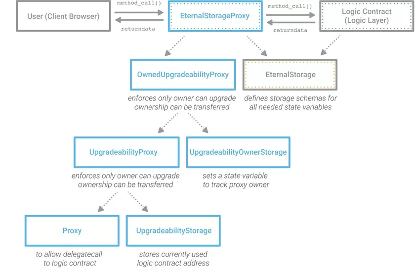

#Openzeppelin

##1. Step of development journey.
**1.1 Setting up a node project**
    Install node, npm, libraries for web3 development

**1.2 Developing smart contracts**
    Write, compile Solidity contracts, using Openzeppelin Contract library.

**1.3 Deploying and Interacting**
    Deploy contract to local blockchain and using the console

**1.4 Writing automated tests**
    Unit test contracts using Openzeppelin test helper and  Openzeppline test environment

**1.5 Connecting to public test networks**
    Deploy app to a public Ethereum testnet
V
**1.6 Upgrading smart contract**
    Change the code of deployed contract to add new feature or fix bugs, using Openzepplin upgrade plugin

**1.7 Preparing for mainet**


##2. Upgrading Smart Contract
```
// contracts/May.sol
//SPDX-License-Identifier: Unlicense
pragma solidity ^0.8.4;

import "@openzeppelin/contracts/token/ERC20/ERC20.sol";
import "@openzeppelin/contracts-upgradeable/proxy/utils/Initializable.sol";
import "@openzeppelin/contracts-upgradeable/token/ERC20/ERC20Upgradeable.sol";

contract May is ERC20Upgradeable   {

    function initialize() public initializer {
       __ERC20_init_unchained('My May', 'MAY');
       _mint(msg.sender, 1000000000000000);
    }

    function decimals() public view virtual override returns (uint8) {
        return 18;
    }

}

```
Deploy
```
const { ethers, upgrades } = require('hardhat');

async function main() {
    const Token = await ethers.getContractFactory('May');
    const token = await upgrades.deployProxy(Token);
    console.log('Deploy may  ', await token.resolvedAddress);
}

main().then(() => {
    console.log('Done');
    process.exit(0)
}).catch(err => {
    console.log(err)
    process.exit(1)
})
```



MayV2 

```
 function decimals() public view virtual override returns (uint8) {
        return 6;
    }
```
Deploy
```
const { ethers, upgrades } = require('hardhat');

async function main() {
    const Tokenv2 = await ethers.getContractFactory('Mayv2');
    const token = await upgrades.upgradeProxy('0xb25cafd4b5FCBAE13Cb6d761dA4fdED3bA07008C', Tokenv2);
    console.log('Deploy may', await token.resolvedAddress);

    console.log('Upgraded');
}

main().then(() => {
    console.log('Done');
    process.exit(0)
}).catch(err => {
    console.log(err)
    process.exit(1)
})
```


Explore: https://rinkeby.etherscan.io/token/0xb25cafd4b5fcbae13cb6d761da4fded3ba07008c#balances

##3. How ? 
- **Pattern**



- **How to Initialize**

1.Deploy an `EternalStorageProxy` instance

2.Deploy an initial version of your contract (v1)

3.Call your `EternalStorageProxy` instance to upgrade to the address of your initial version


- **Source**
>`UpgradeabilityProxy.sol`
```
pragma solidity ^0.4.18;

import './Proxy.sol';
import './UpgradeabilityStorage.sol';


/**
 * @title UpgradeabilityProxy
 * @dev This contract represents a proxy where the implementation address to which it will delegate can be upgraded
 */
contract UpgradeabilityProxy is Proxy, UpgradeabilityStorage {
  /**
  * @dev This event will be emitted every time the implementation gets upgraded
  * @param version representing the version name of the upgraded implementation
  * @param implementation representing the address of the upgraded implementation
  */
  event Upgraded(string version, address indexed implementation);

  /**
  * @dev Upgrades the implementation address
  * @param version representing the version name of the new implementation to be set
  * @param implementation representing the address of the new implementation to be set
  */
  function _upgradeTo(string version, address implementation) internal {
    require(_implementation != implementation);
    _version = version;
    _implementation = implementation;
    Upgraded(version, implementation);
  }
}
```

> `UpgradeabilityStorage.sol`
```
pragma solidity ^0.4.18;

/**
 * @title UpgradeabilityStorage
 * @dev This contract holds all the necessary state variables to support the upgrade functionality
 */
contract UpgradeabilityStorage {
  // Version name of the current implementation
  string internal _version;

  // Address of the current implementation
  address internal _implementation;

  /**
  * @dev Tells the version name of the current implementation
  * @return string representing the name of the current version
  */
  function version() public view returns (string) {
    return _version;
  }

  /**
  * @dev Tells the address of the current implementation
  * @return address of the current implementation
  */
  function implementation() public view returns (address) {
    return _implementation;
  }
}
```
##4. Ref
- https://github.com/OpenZeppelin/openzeppelin-labs/tree/master/upgradeability_using_eternal_storage/contracts
- https://blog.openzeppelin.com/proxy-patterns/
- https://docs.openzeppelin.com/upgrades-plugins/1.x/
- https://docs.openzeppelin.com/upgrades-plugins/1.x/api-hardhat-upgrades
- https://github.com/zeppelinos/zos-lib/pull/36